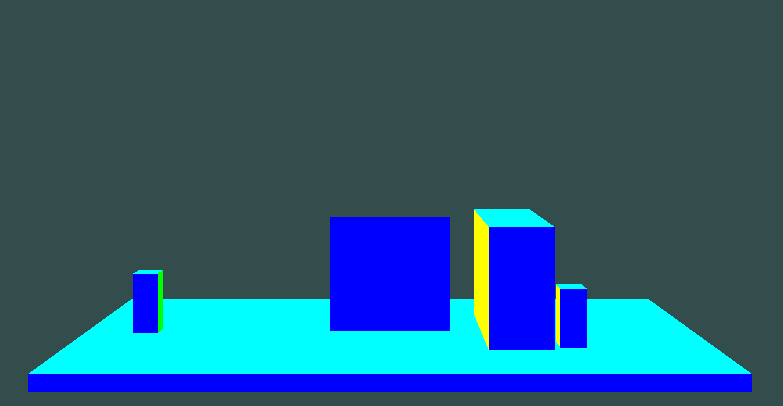

# Lab 1: Introduction to 2D Concepts in OpenGL
## Drawing Two Pentagons with OpenGL

This code is a C++ OpenGL program that creates a window displaying two pentagons. One of the pentagons can be controlled using the keyboard for translation (movement) and rotation.

## Libraries Used

- **GLFW**: A library for creating windows with OpenGL contexts and managing input.
- **GLAD**: A library to load OpenGL function pointers.
- **GLM**: A mathematics library for graphics programming that provides vector and matrix operations.

## Key Components

### Initialization

- The program initializes GLFW and configures OpenGL settings (version, profile).
- A window is created, and if it fails to open, the program will terminate.

### Shader Program

Two shaders are defined:
- **Vertex Shader**: Transforms vertex positions using a transformation matrix.
- **Fragment Shader**: Sets the color of the fragments (pixels) to orange.

```cpp
const char* vertexShaderSource = "#version 330 core\n"
"layout (location = 0) in vec3 aPos;\n"
"uniform mat4 transform;\n"
"void main()\n"
"{\n"
"   gl_Position = transform * vec4(aPos, 1.0);\n"
"}\0";

const char* fragmentShaderSource = "#version 330 core\n"
"out vec4 FragColor;\n"
"void main()\n"
"{\n"
"   FragColor = vec4(1.0f, 0.5f, 0.2f, 1.0f);\n"
"}\n\0";
```

### Vertex Data

The vertex data for two pentagons is defined in the `vertices` array. The coordinates are specified for each vertex of the pentagons.

```cpp
float vertices[] = {
    -0.5f, +0.3f, +0.0f, // 1
    +0.0f, +0.8f, +0.0f, // 2
    -0.4f, -0.5f, +0.0f, // 3
    +0.5f, +0.3f, +0.0f, // 4
    +0.4f, -0.5f, +0.0f, // 5
};
```

### Vertex Array and Buffer Objects

- **Vertex Array Object (VAO)** and **Vertex Buffer Object (VBO)** are created and configured to hold the vertex data.
- The VAO encapsulates the state needed to supply vertex data to the OpenGL pipeline.

### Render Loop

The render loop continues until the window is closed. Within this loop:
1. **Input Handling**: The program checks for keyboard inputs to control the first pentagon's translation and rotation.
2. **Clearing the Screen**: The color buffer is cleared with a specified background color.
3. **Transformation Matrices**: For each pentagon, transformation matrices are created to apply translations, rotations, and scaling.

### Keyboard Input Control

The `processInput` function handles user input:
- **Arrow Keys**: Control the translation of the first pentagon.
- **R and T Keys**: Control the rotation of the first pentagon.

```cpp
void processInput(GLFWwindow* window)
{
    if (glfwGetKey(window, GLFW_KEY_ESCAPE) == GLFW_PRESS)
        glfwSetWindowShouldClose(window, true);
    // Control translations
    if (glfwGetKey(window, GLFW_KEY_D) == GLFW_PRESS) translate_X += 0.001;
    if (glfwGetKey(window, GLFW_KEY_A) == GLFW_PRESS) translate_X -= 0.001;
    if (glfwGetKey(window, GLFW_KEY_W) == GLFW_PRESS) translate_Y += 0.001;
    if (glfwGetKey(window, GLFW_KEY_S) == GLFW_PRESS) translate_Y -= 0.001;
    // Control rotation
    if (glfwGetKey(window, GLFW_KEY_R) == GLFW_PRESS) rotateAngle += 0.1;
    if (glfwGetKey(window, GLFW_KEY_T) == GLFW_PRESS) rotateAngle -= 0.1;
}
```

### Drawing the Pentagons

The pentagons are drawn using the `glDrawArrays` function, which takes the VAO and the count of vertices to render.

<div align="center">
    
    <p><em>Figure 1: Pentagon</em></p>
</div>

### Cleanup

Once the window is closed, resources (VAO, VBO, shader program) are deleted, and GLFW is terminated.

## Conclusion

This program demonstrates the basics of OpenGL, including setting up a rendering context, creating shaders, handling user input, and rendering geometric shapes. It can be extended further to add more complex shapes, animations, or interactions.

Learn More about [Lab 01](Lab01/TEACHME.md)


---
---

# Lab 2: Introduction to 3D Concepts in OpenGL

## Drawing a Computer Setup Using 3D Cube

This C++ OpenGL program introduces the basic concepts of 3D graphics. In this lab, a computer setup is drawn by manipulating 3D cubes. These cubes are transformed in 3D space to form different parts of the computer setup.

## Libraries Used

- **GLFW**: A library for creating windows with OpenGL contexts and managing input.
- **GLAD**: A library to load OpenGL function pointers.
- **GLM**: A mathematics library for graphics programming that provides vector and matrix operations.

## Key Components

### Initialization

- Similar to Lab 1, the program initializes GLFW, configures OpenGL settings, and creates a window.
- If the window creation fails, the program will terminate.

### Shader Program

Two shaders are defined:
- **Vertex Shader**: Applies transformation matrices to position vertices in 3D space.
- **Fragment Shader**: Sets the color of the fragments (pixels) to be displayed.

```cpp
const char* vertexShaderSource = "#version 330 core\n"
"layout (location = 0) in vec3 aPos;\n"
"uniform mat4 transform;\n"
"void main()\n"
"{\n"
"   gl_Position = transform * vec4(aPos, 1.0);\n"
"}\0";

const char* fragmentShaderSource = "#version 330 core\n"
"out vec4 FragColor;\n"
"void main()\n"
"{\n"
"   FragColor = vec4(0.8f, 0.6f, 0.2f, 1.0f);\n"
"}\n\0";
```

### Cube Data

The vertex data for a cube is defined in the vertices array. The coordinates define the positions of the 8 corners of a cube.
```code
float vertices[] = {
    // Positions of the vertices of a cube
    -0.5f, -0.5f, -0.5f, // 0
    +0.5f, -0.5f, -0.5f, // 1
    +0.5f, +0.5f, -0.5f, // 2
    -0.5f, +0.5f, -0.5f, // 3
    -0.5f, -0.5f, +0.5f, // 4
    +0.5f, -0.5f, +0.5f, // 5
    +0.5f, +0.5f, +0.5f, // 6
    -0.5f, +0.5f, +0.5f  // 7
};
```

### Vertex Array and Buffer Objects

- Vertex Array Object (VAO) and Vertex Buffer Object (VBO) are created and configured to store the vertex data.
- The VAO encapsulates the state needed to send vertex data to OpenGL for rendering.

### Render Loop

The render loop continues until the window is closed. In each iteration:

- Input Handling: The program checks for user input to control the translation and rotation of the cube setup.
- Clearing the Screen: The color buffer is cleared with a specified background color.
- Transformation Matrices: A transformation matrix is created to handle rotations and translations, so the cubes can be positioned in the 3D space as a part of the computer setup.

### Keyboard Input Control

The processInput function handles user input for moving and rotating the cubes:

- Arrow Keys: Translate the cubes in 3D space.
- R and T Keys: Control the rotation of the cubes.
```code
void processInput(GLFWwindow* window)
{
    if (glfwGetKey(window, GLFW_KEY_ESCAPE) == GLFW_PRESS)
        glfwSetWindowShouldClose(window, true);

    if (glfwGetKey(window, GLFW_KEY_RIGHT) == GLFW_PRESS) translate_X += 0.001;
    if (glfwGetKey(window, GLFW_KEY_LEFT) == GLFW_PRESS) translate_X -= 0.001;
    if (glfwGetKey(window, GLFW_KEY_UP) == GLFW_PRESS) translate_Y += 0.001;
    if (glfwGetKey(window, GLFW_KEY_DOWN) == GLFW_PRESS) translate_Y -= 0.001;
    if (glfwGetKey(window, GLFW_KEY_SPACE) == GLFW_PRESS) translate_Z += 0.001;
    if (glfwGetKey(window, GLFW_KEY_0) == GLFW_PRESS) translate_Z -= 0.001;

    if (glfwGetKey(window, GLFW_KEY_C) == GLFW_PRESS) scale_X += 0.01;
    if (glfwGetKey(window, GLFW_KEY_V) == GLFW_PRESS) scale_X -= 0.01;
    if (glfwGetKey(window, GLFW_KEY_B) == GLFW_PRESS) scale_Y += 0.01;
    if (glfwGetKey(window, GLFW_KEY_N) == GLFW_PRESS) scale_Y -= 0.01;
    if (glfwGetKey(window, GLFW_KEY_M) == GLFW_PRESS) scale_Z += 0.01;
    if (glfwGetKey(window, GLFW_KEY_U) == GLFW_PRESS) scale_Z -= 0.01;

    if (glfwGetKey(window, GLFW_KEY_X) == GLFW_PRESS)
    {
        rotateAngle_X += 1;
    }
    if (glfwGetKey(window, GLFW_KEY_Y) == GLFW_PRESS)
    {
        rotateAngle_Y += 1;
    }
    if (glfwGetKey(window, GLFW_KEY_Z) == GLFW_PRESS)
    {
        rotateAngle_Z += 1;
    }

    if (glfwGetKey(window, GLFW_KEY_H) == GLFW_PRESS)
    {
        eyeX += 2.5 * deltaTime;
        basic_camera.eye = glm::vec3(eyeX, eyeY, eyeZ);
    }
    if (glfwGetKey(window, GLFW_KEY_F) == GLFW_PRESS)
    {
        eyeX -= 2.5 * deltaTime;
        basic_camera.eye = glm::vec3(eyeX, eyeY, eyeZ);
    }
    if (glfwGetKey(window, GLFW_KEY_T) == GLFW_PRESS)
    {
        eyeZ += 2.5 * deltaTime;
        basic_camera.eye = glm::vec3(eyeX, eyeY, eyeZ);
    }
    if (glfwGetKey(window, GLFW_KEY_G) == GLFW_PRESS)
    {
        eyeZ -= 2.5 * deltaTime;
        basic_camera.eye = glm::vec3(eyeX, eyeY, eyeZ);
    }
    if (glfwGetKey(window, GLFW_KEY_Q) == GLFW_PRESS)
    {
        eyeY += 2.5 * deltaTime;
        basic_camera.eye = glm::vec3(eyeX, eyeY, eyeZ);
    }
    if (glfwGetKey(window, GLFW_KEY_E) == GLFW_PRESS)
    {
        eyeY -= 2.5 * deltaTime;
        basic_camera.eye = glm::vec3(eyeX, eyeY, eyeZ);
    }
    if (glfwGetKey(window, GLFW_KEY_1) == GLFW_PRESS)
    {
        lookAtX += 2.5 * deltaTime;
        basic_camera.lookAt = glm::vec3(lookAtX, lookAtY, lookAtZ);
    }
    if (glfwGetKey(window, GLFW_KEY_2) == GLFW_PRESS)
    {
        lookAtX -= 2.5 * deltaTime;
        basic_camera.lookAt = glm::vec3(lookAtX, lookAtY, lookAtZ);
    }
    if (glfwGetKey(window, GLFW_KEY_3) == GLFW_PRESS)
    {
        lookAtY += 2.5 * deltaTime;
        basic_camera.lookAt = glm::vec3(lookAtX, lookAtY, lookAtZ);
    }
    if (glfwGetKey(window, GLFW_KEY_4) == GLFW_PRESS)
    {
        lookAtY -= 2.5 * deltaTime;
        basic_camera.lookAt = glm::vec3(lookAtX, lookAtY, lookAtZ);
    }
}
```

### Drawing the Computer Setup

Multiple cubes are drawn to represent the different parts of the computer setup, such as the monitor, CPU, and keyboard.
```code
void drawCube(glm::mat4 transform) {
    glBindVertexArray(VAO);
    glUseProgram(shaderProgram);
    unsigned int transformLoc = glGetUniformLocation(shaderProgram, "transform");
    glUniformMatrix4fv(transformLoc, 1, GL_FALSE, glm::value_ptr(transform));
    glDrawArrays(GL_TRIANGLES, 0, 36); // Drawing the cube
}
```

<div align="center">
    
    <p><em>Figure 2: Computer Setup</em></p>
</div>

### Cleanup

Once the window is closed, resources like the VAO, VBO, and shader program are deleted, and GLFW is terminated.

### Conclusion

This program demonstrates the basics of 3D graphics in OpenGL, including creating and manipulating cubes in 3D space, applying transformations such as translation and rotation, and handling user input for real-time manipulation. It serves as a foundation for building more complex 3D scenes, such as creating a full 3D computer setup.

Learn More about [Lab 02](Lab02/TEACHME.md)
