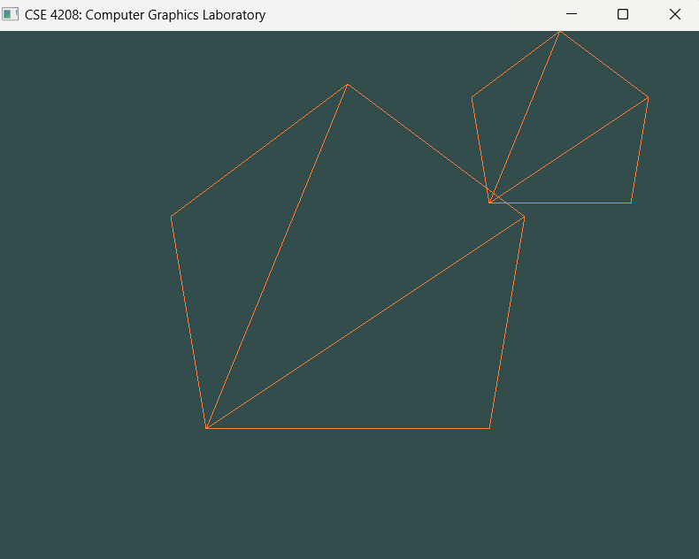

# Drawing Two Pentagons with OpenGL

This code is a C++ OpenGL program that creates a window displaying two pentagons. One of the pentagons can be controlled using the keyboard for translation (movement) and rotation.

## Libraries Used

- **GLFW**: A library for creating windows with OpenGL contexts and managing input.
- **GLAD**: A library to load OpenGL function pointers.
- **GLM**: A mathematics library for graphics programming that provides vector and matrix operations.

## Key Components

### Initialization

- The program initializes GLFW and configures OpenGL settings (version, profile).
- A window is created, and if it fails to open, the program will terminate.

### Shader Program

Two shaders are defined:
- **Vertex Shader**: Transforms vertex positions using a transformation matrix.
- **Fragment Shader**: Sets the color of the fragments (pixels) to orange.

```cpp
const char* vertexShaderSource = "#version 330 core\n"
"layout (location = 0) in vec3 aPos;\n"
"uniform mat4 transform;\n"
"void main()\n"
"{\n"
"   gl_Position = transform * vec4(aPos, 1.0);\n"
"}\0";

const char* fragmentShaderSource = "#version 330 core\n"
"out vec4 FragColor;\n"
"void main()\n"
"{\n"
"   FragColor = vec4(1.0f, 0.5f, 0.2f, 1.0f);\n"
"}\n\0";
```

### Vertex Data

The vertex data for two pentagons is defined in the `vertices` array. The coordinates are specified for each vertex of the pentagons.

```cpp
float vertices[] = {
    -0.5f, +0.3f, +0.0f, // 1
    +0.0f, +0.8f, +0.0f, // 2
    -0.4f, -0.5f, +0.0f, // 3
    +0.5f, +0.3f, +0.0f, // 4
    +0.4f, -0.5f, +0.0f, // 5
};
```

### Vertex Array and Buffer Objects

- **Vertex Array Object (VAO)** and **Vertex Buffer Object (VBO)** are created and configured to hold the vertex data.
- The VAO encapsulates the state needed to supply vertex data to the OpenGL pipeline.

### Render Loop

The render loop continues until the window is closed. Within this loop:
1. **Input Handling**: The program checks for keyboard inputs to control the first pentagon's translation and rotation.
2. **Clearing the Screen**: The color buffer is cleared with a specified background color.
3. **Transformation Matrices**: For each pentagon, transformation matrices are created to apply translations, rotations, and scaling.

### Keyboard Input Control

The `processInput` function handles user input:
- **Arrow Keys**: Control the translation of the first pentagon.
- **R and T Keys**: Control the rotation of the first pentagon.

```cpp
void processInput(GLFWwindow* window)
{
    if (glfwGetKey(window, GLFW_KEY_ESCAPE) == GLFW_PRESS)
        glfwSetWindowShouldClose(window, true);
    // Control translations
    if (glfwGetKey(window, GLFW_KEY_D) == GLFW_PRESS) translate_X += 0.001;
    if (glfwGetKey(window, GLFW_KEY_A) == GLFW_PRESS) translate_X -= 0.001;
    if (glfwGetKey(window, GLFW_KEY_W) == GLFW_PRESS) translate_Y += 0.001;
    if (glfwGetKey(window, GLFW_KEY_S) == GLFW_PRESS) translate_Y -= 0.001;
    // Control rotation
    if (glfwGetKey(window, GLFW_KEY_R) == GLFW_PRESS) rotateAngle += 0.1;
    if (glfwGetKey(window, GLFW_KEY_T) == GLFW_PRESS) rotateAngle -= 0.1;
}
```

### Drawing the Pentagons

The pentagons are drawn using the `glDrawArrays` function, which takes the VAO and the count of vertices to render.

<div align="center">
    
    <p><em>Figure 1: Pentagon</em></p>
</div>

### Cleanup

Once the window is closed, resources (VAO, VBO, shader program) are deleted, and GLFW is terminated.

## Conclusion

This program demonstrates the basics of OpenGL, including setting up a rendering context, creating shaders, handling user input, and rendering geometric shapes. It can be extended further to add more complex shapes, animations, or interactions.
